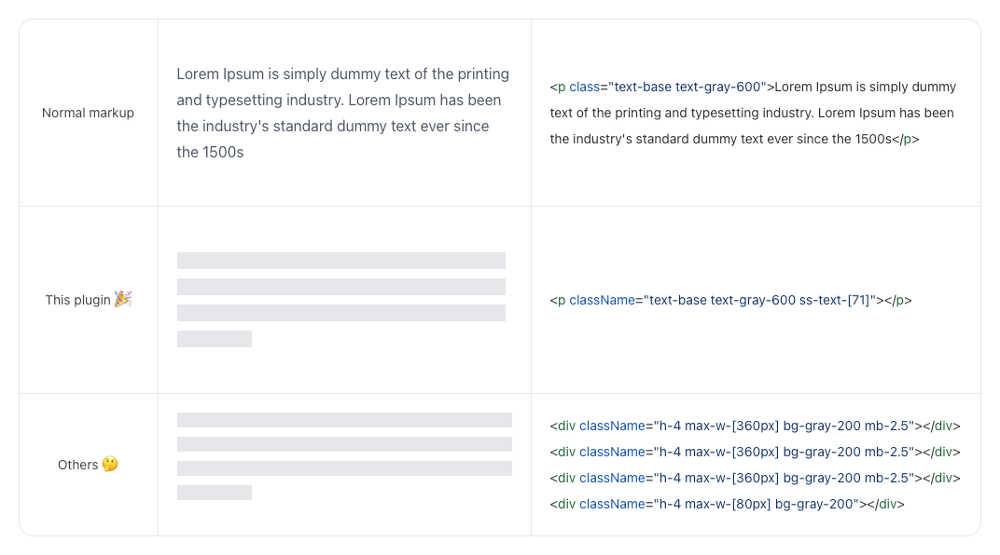

# tailwindcss-skeleton-screen
Just add the class. Not by width or height, but by number of characters.

## Concept
- `As close as possible to normal markup`


### Differences from Others



[PR for checking diff](https://github.com/t4y3/tailwindcss-skeleton-screen/pull/2/files)

### Number of characters, not Height and width
```tsx
// ❌ 
<p className="h-14 w-full bg-gray-100" />
```
↓
```tsx
// 😍
<p className="ss-text-[24]" />
```

### Wrapping of long sentences is also supported
```tsx
// ❌
<p className="h-14 w-full bg-gray-100" />
<p className="h-14 w-full bg-gray-100" />
<p className="h-14 w-1/2 bg-gray-100" />
```
↓
```tsx
// 😍 
<p className="ss-text-[120]" />
```


## Installation
Install the plugin from npm:

```shell
npm install -D tailwindcss-skeleton-screen
```

Then add the plugin to your tailwind.config.js file:

```js
/** @type {import('tailwindcss').Config} */
module.exports = {
  theme: {
    extend: {
      skeletonScreen: {
        color: '#d0d0d0' // optional
      }
    }
  },
  plugins: [
    require('tailwindcss-skeleton-screen')
  ]
};

```

## Basic usage
- Only the number of characters is specified.
- The height can be changed by font-size and light-height, so there is no need to specify it for skeleton.


| class           |   |
|-----------------|---|
| ss-object       | Display skeleton with background-color |
| ss-text-[n]     | Display skeleton for n characters |
| ss-text-[n/n/n] | The number of characters per line can be specified by separating each line with a "slash (/)". |

